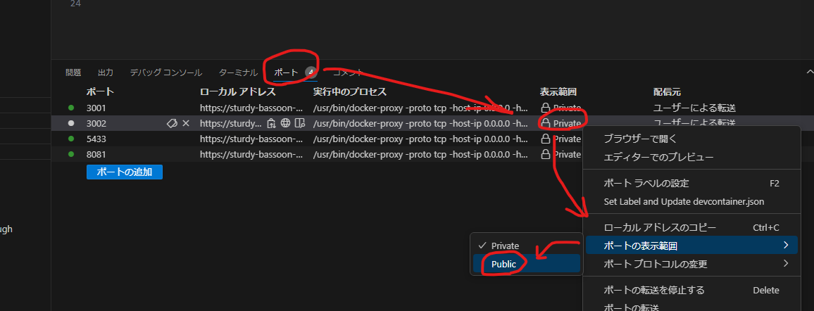

## 環境構築
### 0.docker構築
1. [initリポジトリ](https://github.com/githuno/init_devs)をクローンしておく  

2. dockerインストール
    - mac/Linux     : そのままDockerインストール　　
    - win           : WSL2を有効化後にDockerインストール　　
    - codespace     :「code」ボタン->「Create codespace on main」ボタン（dockerは既に入ってる）

    ターミナルコンソールで`docker --version`が有効か確認する  

3. VScodeにdocker拡張機能を追加しておく

### 1.初期化スクリプト実行
`. <PATH TO>/nextrails.sh`  
例1：`. naextrails.sh`  

### 2.サーバ起動確認
Docker拡張のGUI操作で、各コンテナに「Attach shell」

- ##### 各サーバーの立ち上げ
backend: `rails s -e`
frontend: `yarn dev`

    各ポート番号に注意しながら、ブラウザで開いて起動を確認

- ##### bashへの切り替え
`bash`

【codespaceの場合】
ターミナルでバックエンドのポートをpublicに変更することで、フロント”クライアント”からのCRUD操作(axios)が可能になる。
※自動でリセットされるため、起動時は毎回変更が必要。
※フロント”サーバー”からの操作はプライベートネットワークを使用できるため本操作は不要

※axios以外のリクエストではGITHUB_TOKENを使うことでvisibility:privateのまま通信可能
    - 例:`curl -v -X POST -H "X-Github-Token: ghu_XXX" -H 'Content-Type: application/json' -d '{"title":"XXX", "content":"XXX"}' https://XXX-3002.app.github.dev/XXX`

<!-- 【codespaceの場合】
1. `code <PATH TO>/frontend`および`code <PATH TO>/backend`
2. backend（rails）では、/config/environments/development.rb にエラーメッセージで指定されたホスト名を追記する。
    https://engr-sng.com/blog/ruby1

    /config/environments/development.rb
    ```
    Rails.application.configure do
    
    =====中略=====
    
        config.hosts << "xxxxxxxxxx.vfs.cloud9.ap-northeast-1.amazonaws.com"
    end
    ``` -->


### 3.dbの可視化
#### adminerから：
 [localhost:8081](http://localhost:8081)
- ###### Adminerについて
[Nginx+Rails6.0+MySQL8.0+Adminer：docker-compose で rails new](https://zenn.dev/junki555/articles/13da16e4f10c9dee2bb9)   
[Dockerのポート番号とIPアドレスについて](https://www.distant-view.co.jp/column/3107/)

#### 外部ブラウザから：
- [apidog](https://apidog.com/jp/)
- [postman](https://www.postman.com/)

#### 外部vscodeから：
- [thunder Client](https://marketplace.visualstudio.com/items?itemName=rangav.vscode-thunder-client)
- [Rapid API Client](https://marketplace.visualstudio.com/items?itemName=RapidAPI.vscode-rapidapi-client)

#### 内部vscodeから：
- [PostgreSQL](https://marketplace.visualstudio.com/items?itemName=ckolkman.vscode-postgres)
        [VScodeのPostgreSQL拡張が便利](https://od10z.wordpress.com/2019/12/17/vscode-extensions-for-postgresql/)   


---
## 参考サイト
- [React開発効率を3倍にするVS Code拡張機能&環境設定](https://qiita.com/newt0/items/b7810fb38c339ec5e4a7)  
- [Nginx+Next.js+Rails+PostgreSQLを使用した開発環境構築](https://computer-tb.co.jp/2022/06/22/nginxnext-jsrailspostgresql%E3%82%92%E4%BD%BF%E7%94%A8%E3%81%97%E3%81%9F%E9%96%8B%E7%99%BA%E7%92%B0%E5%A2%83%E6%A7%8B%E7%AF%89/)

- マウントの記述方法について（Permission Deniedエラー）
    - https://zenn.dev/sarisia/articles/0c1db052d09921
    - https://qiita.com/houchiey/items/ef0321956821c05b4b6a
    - https://docs.docker.jp/v1.11/compose/compose-file.html#volumes-volume-driver

---

### よく使うdocker系操作
`docker system prune -a --volumes`

`sudo docker stop $(sudo docker ps -aq)`

`sudo systemctl stop docker`

`sudo systemctl restart docker`

`sudo rm -rf /var/lib/docker`
